# CatPang — 고양이 매치-3 퍼즐

*9×9 보드 위에서 고양이를 밀어 터뜨린다 — 폭탄 합성·보스전·일일 미션까지 갖춘 모바일 매치-3.*

> 🎯 **개인 프로젝트** · 코드네임 **CatPang** · Unity 6 · Android(Google Play) · 싱글플레이 · **🚀 Google Play 정식 출시**
>
> 🎮 **한 줄 컨셉** · 9×9 격자에서 같은 색 3개·2×2 정사각형을 맞춰 터뜨리고, 매치 모양으로 만든 **특수블록을 합성**해 장애물과 보스를 돌파
>
> 🧱 **설계 키워드** · 매니저 허브 오케스트레이션 · 게임/인프라 분리(자체 UPM 패키지) · 데이터 주도(JSON + Addressables) · MVVM + UniRx · 헤드리스 밸런스 시뮬

[](https://play.google.com/store/apps/details?id=com.chvj7567.catpang)
[]()
[]()
[]()
[]()
[]()
[]()

> 📱 **지금 플레이하기** — [**Google Play 스토어에서 CatPang 다운로드**](https://play.google.com/store/apps/details?id=com.chvj7567.catpang) (`com.chvj7567.catpang`)

### ▶️ 전체 플레이 영상

[](https://youtube.com/shorts/i_XJVvsrXBw)

> 한 스테이지 플레이 — 상단 목표 블록 + 이동수/타이머, 드래그로 색 맞추기, 특수블록 생성과 연쇄 폭발, 클리어 연출. (썸네일 클릭 시 YouTube 로 이동)

---

## 🎮 어떤 게임인가

**CatPang** 은 고양이를 테마로 한 모바일 매치-3 퍼즐입니다. 9×9 격자에서 블록을 밀어 같은 색을 맞추는 고전 규칙 위에, **매치 모양으로 특수블록을 만들고 그 둘을 합성**하는 레이어를 얹어 한 수의 선택지를 넓혔습니다.

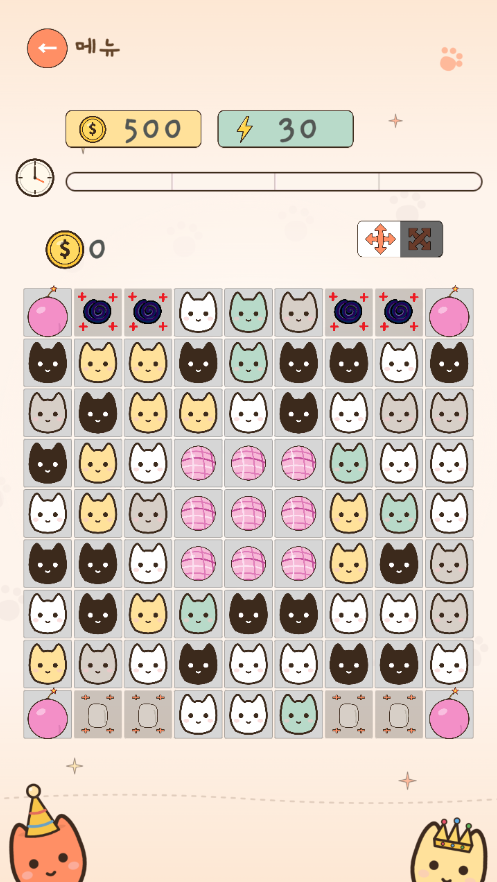

- **밀어서 맞추고, 모양으로 강해진다.** 3개 직선 매치는 기본, **2×2 정사각형**은 캣팡, **4매치 이상**은 화살표, **가로+세로 교차**는 십자/대각선 폭탄을 만듭니다. 어떤 모양으로 터뜨리느냐가 곧 다음 폭탄의 종류입니다.
- **특수블록은 합쳐서 쓴다.** 색폭탄끼리 붙이면 전체 폭발, 화살표끼리는 색폭탄으로 승급, 핑크폭탄은 닿은 색을 보드에서 전부 제거 — 한 번의 스왑이 판 전체를 쓸어버리는 빅 플레이로 이어집니다.
- **장애물과 보스가 길을 막는다.** 벽·포탈·고양이 상자·물고기·공·생성기 등 매치만으로는 못 깨는 블록이 목표를 지키고, **별도의 보스 스테이지(100개)** 에서는 보스가 벽 소환·블록 생성으로 방해합니다.
- **매일 돌아올 이유.** NTP 서버 시각 기준 자정 리셋 일일 미션(클리어·블록 파괴·광고·출석)과 6종 고양이 스킨 컬렉션이 한 판 이상의 동기를 만듭니다.

| 클리어 | 실패 |
|:---:|:---:|
| 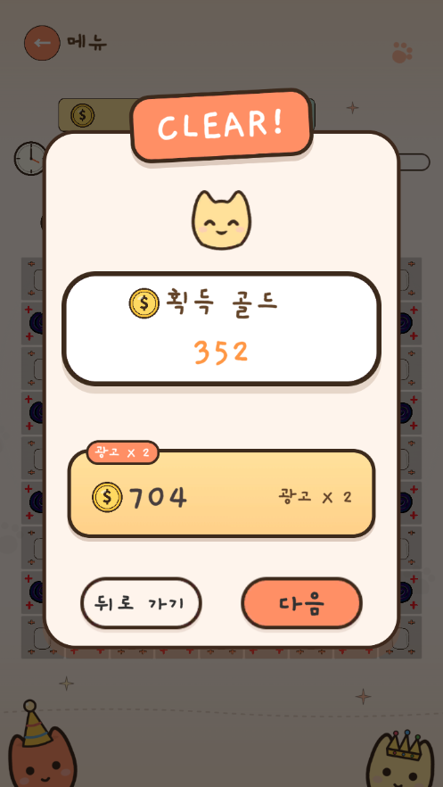 | 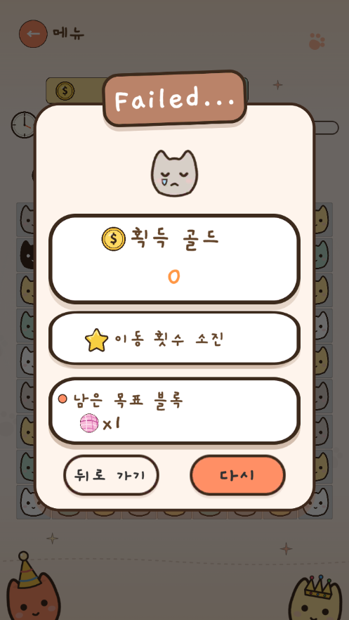 |

> **개발 의도:** 매치-3 의 "한 수"가 단순 색 맞추기에서 끝나지 않고 *특수블록 설계 → 합성 → 연쇄*로 이어지는 깊이를 만드는 것. 그리고 그 깊이를 **사람이 수백 판 돌리지 않고도 헤드리스 시뮬레이션으로 검증**하는 토대를 갖추는 것이 이 프로젝트의 두 축입니다.

### 세 가지 플레이 모드 — 같은 맵, 다른 압박

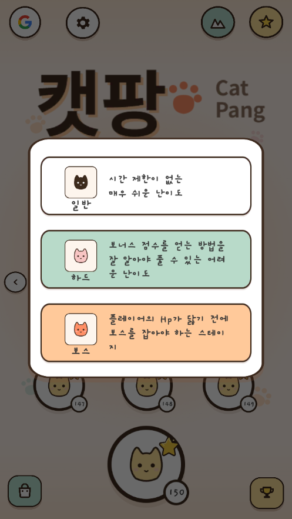

| 모드 | 스테이지 | 제약 | 특징 |
|---|---|---|---|
| **노멀** | 150 | 이동 횟수 제한(2배), 시간 제한 없음 | 하드 데이터 재사용 + 완화 적용. 여유롭게 클리어 |
| **하드** | 150 | 시간 제한 + 이동 제한 | 같은 맵을 빠르게 풀어야 하는 도전 |
| **보스** | 100 | 보스 HP + 스킬 방해 | 노멀/하드와 분리된 전용 스테이지. 벽/생성기/고양이상자 패턴 |

> 노멀·하드는 **하나의 공유 테이블(150개)** 을 쓰고, 노멀 모드는 별도 JSON 없이 실행 시 *시간제한 제거 + 이동 2배* 를 적용합니다. (`Stage.json` 행 250 ≠ 플레이 모드 수 400)

---

## 🧩 한눈에 보는 구조

부팅부터 한 판까지 **하나의 매니저 허브(`CHMMain`)가 작은 매니저들을 정해진 순서로 조립**하고, 게임 코드는 재사용 가능한 인프라 패키지(ChvjPackage)에 일방향으로만 의존합니다.

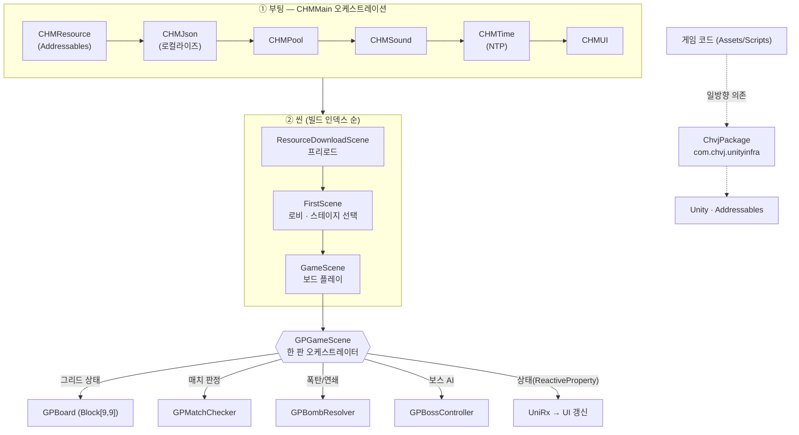

### 설계 원칙 — 왜 이렇게 짰는가

| 원칙 | 무엇을 | 왜 (포트폴리오 관점) |
|---|---|---|
| **매니저 허브 오케스트레이션** | 리소스·풀·사운드·시간·UI 초기화를 `CHMMain` 하나가 idempotent 순서로 조율 | 부팅 순서 의존이 한 곳에 모여, 매니저 추가·교체가 국소적 |
| **게임 / 인프라 분리** | 리소스 로딩·풀·UI·오디오·광고/IAP/소셜을 자체 UPM 패키지로 추출 | 게임에 비종속이라 **다른 프로젝트에 그대로 이식**(실제로 다른 프로젝트와 공유 중) |
| **Enum = 에셋 파일명 규칙** | `EUI.UIShop` → `UIShop.prefab`, `EBlockState.Cat1` → 스프라이트명 | 하드코딩 문자열 키 제거, Addressables 주소를 enum 으로 정적 검증 |
| **데이터 주도** | 스테이지·블록 배치·문자열·상수를 JSON 으로, 9×9 맵을 에디터 툴로 제작 | 밸런싱·스테이지 추가가 코드 재컴파일 없이 데이터 편집으로 끝남 |
| **MVVM + UniRx** | 게임 상태를 `ReactiveProperty<EGameState>` 로, UI 는 구독해 갱신 | 보드 로직과 화면 표시 분리, 상태 변화 한 방향 흐름 |
| **헤드리스 시뮬 가능 설계** | 보드/매치/폭탄 규칙을 Unity 비의존 순수 C# (`Sim/`)으로 재구현 | 런타임 없이 수백 판 자동 플레이로 밸런스·커버리지 검증 |

---

## ✨ 핵심 시스템 (게임 + 구조)

각 시스템은 **무엇을 위한 것인지(게임)** 와 **어떻게/왜 그렇게 구성했는지(구조)** 로 설명합니다.

## 1. 🧩 매치-3 코어 — 모양이 곧 전략

> **게임:** 9×9 판에서 블록을 상하좌우로 밀어 같은 색 3개 또는 2×2 정사각형을 맞춥니다. 빈 자리는 위에서 새 블록이 떨어져 채워지고, 그 과정에서 또 매치가 나면 **연쇄**가 이어집니다. 핵심은 *어떤 모양으로 터뜨리느냐* — 모양이 다음 폭탄을 결정합니다.

| ① 특수블록 생성 | ② 발동 · 폭발 | ③ 매치 보상 |
|:---:|:---:|:---:|
| 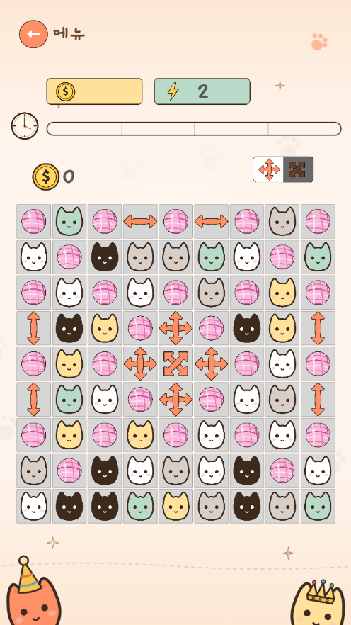 | 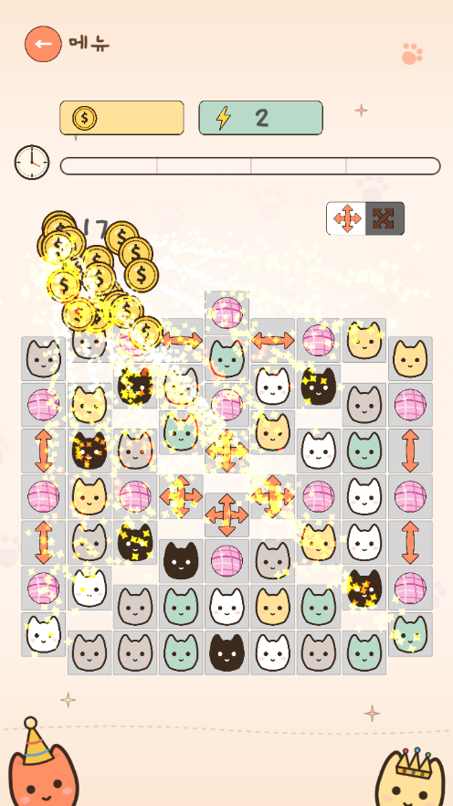 | 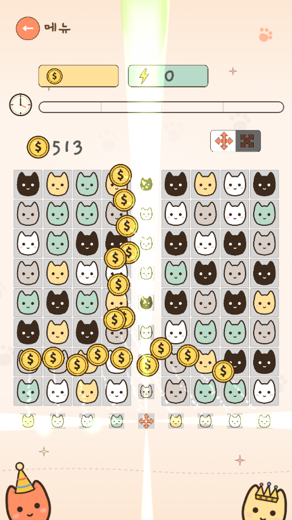 |

> 한 수의 흐름 — 매치 모양으로 **특수블록을 만들고**(①), 그것을 **발동해 보드를 쓸고**(②), 빈 자리가 채워지며 **골드를 획득**(③)한다.

| 이렇게 맞추면 | 생기는 블록 | 터뜨리면 |
|---|---|---|
| 2×2 정사각형 | **캣팡** | 자기 포함 3×3 폭발 |
| 가로 4개 이상 | **가로 화살표** | 가로 한 줄 제거 |
| 세로 4개 이상 | **세로 화살표** | 세로 한 줄 제거 |
| 가로+세로 교차 | **십자 / X 화살표** | 십자(+) 또는 대각선(×) 전체 제거 |

<details>
<summary>구조 — 어떻게 구성했나</summary>

- 한 판의 라이프사이클은 `GPGameScene` 이 조율하고, **그리드 상태(`GPBoard`, `Block[9,9]`)·매치 판정(`GPMatchChecker`)·폭탄 연쇄(`GPBombResolver`)** 를 각각 분리된 클래스가 담당합니다.
- 매치 판정은 가로/세로 3매치와 2×2 정사각형 매치를 동시에 보고, 점수(`hScore`/`vScore`)·정사각형 플래그로 **어떤 특수블록을 생성할지 분기**합니다.
- 블록은 `Block` 컴포넌트가 드래그 입력(`OnBeginDrag`/`OnEndDrag` → 4방향 `EDrag`)을 받고, `IsNormalBlock()`/`IsBombBlock()`/`IsFixdBlock()` 등 분류 메서드로 규칙을 태웁니다.

</details>

## 2. 💣 특수블록 합성 — 한 수로 판을 쓸다

> **게임:** 특수블록은 혼자 터뜨려도 강하지만, **둘을 맞붙이면** 훨씬 커집니다. 색폭탄끼리는 보드 전체 폭발, 화살표끼리는 색폭탄으로 승급, 핑크폭탄은 닿은 색을 보드에서 전부 제거. 레인보우 블록은 색폭탄을 보드에 흩뿌립니다. "지금 합칠까, 더 키울까"의 판단이 매 수에 들어갑니다.

<details>
<summary>구조 — 어떻게 구성했나</summary>

- 폭탄별 효과(`CatPang`/`Arrow1~6`/5색 색폭탄/`RainbowPang`)는 각각 `Bomb1`~`Bomb12` 메서드로 범위 기하(3×3·한 줄·십자·대각선·마름모·테두리)를 정의합니다.
- 합성은 두 폭탄을 스왑하는 순간 `GPGameScene.AfterDrag` 에서 조합 규칙으로 분기 — 특수+특수 → 전체 폭발, 핑크+일반 → 동색 전체 제거, 화살표+화살표 → 색폭탄 승급.
- 연쇄는 폭탄이 인접 폭탄을 순차 트리거하는 체인으로 처리되어, 한 번의 발동이 보드를 가로질러 퍼집니다.

</details>

## 3. 🧱 장애물 & 보스 — 매치만으론 못 깬다

> **게임:** 일반 매치로는 사라지지 않는 블록이 목표를 지킵니다 — 옆에서 데미지를 줘야 부서지는 **벽·포탈**, 받는 색 고양이를 위 칸으로 보내야 하는 **고양이 상자**, 맨 아래줄로 흘려보내야 탈출하는 **물고기/공**, 매 턴 장애물을 만드는 **생성기**. 그리고 보스 스테이지에서는 보스가 직접 방해 패턴을 씁니다.

| 교전 시작 | 벽 소환 방해 | HP 마무리 |
|:---:|:---:|:---:|
| 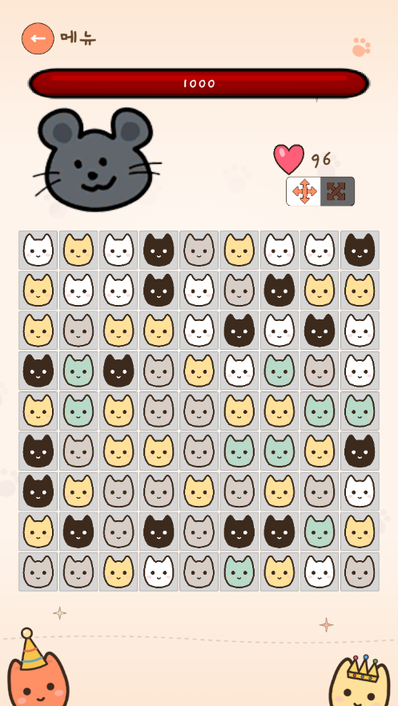 | 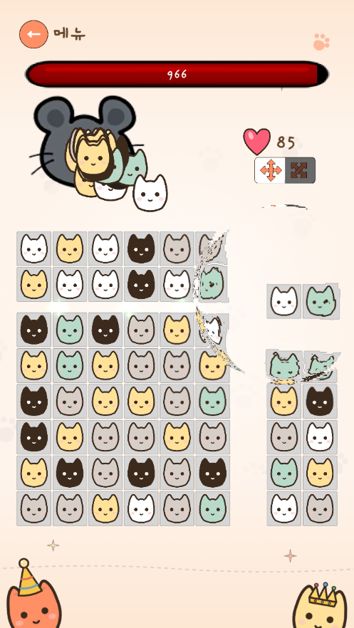 | 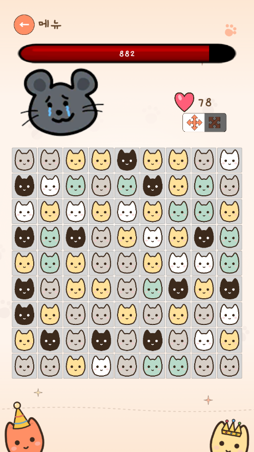 |

> 보스의 HP 를 깎아 가는 흐름 — ②에서 보스가 회색 **벽 블록을 소환**해 매치 동선을 막는 방해 패턴이 보인다.

| 블록 | 제거 방법 |
|---|---|
| **벽 / 포탈** | 바로 옆 매치로 HP 감소, 0이면 일반 블록으로 변환·소멸 |
| **고양이 상자** | 상자 바로 위 칸에 받는 색 고양이를 놓아 빨아들임(매치 아님) |
| **물고기** | 폭탄 제거 불가 — 맨 아래줄 도달로만 탈출 |
| **공(Ball)** | 폭탄으로 직접 제거 또는 맨 아래줄로 굴려 포탈 변환 |
| **생성기(벽/포탈)** | 매 턴 주변 장애물 생성 — 옆에서 매치해 먼저 부숨 |

<details>
<summary>구조 — 어떻게 구성했나</summary>

- 보스 AI(`GPBossController`)는 `EBossSkillType`(Wall/Creator/CatBox) 으로 스테이지별 방해 패턴을 분기합니다.
- 클리어 판정은 "HP 를 가진 블록(목표) + 물고기/공이 하나도 남지 않음" 으로, 일반 고양이 블록(`SetHp(-1)`)은 목표에서 제외됩니다. `RainbowPang`·생성기 등은 별도 가드로 집계 규칙을 따릅니다.
- 실패 사유는 `EFailReason`(TimeOver/MoveOver/HpOver) 로 분류되어 결과 화면(`UIGameEnd`)에 표시됩니다.

</details>

## 4. 📅 일일 미션 & 시간 — 기기 시각 위변조 방어

> **게임:** 매일 자정에 초기화되는 미션(스테이지 클리어·블록 파괴·광고 시청·출석)으로 재방문 동기를 만듭니다. 단, 기기 시각을 조작해 미션을 반복 클리어하지 못하도록 **서버 시각**을 기준으로 삼았습니다.

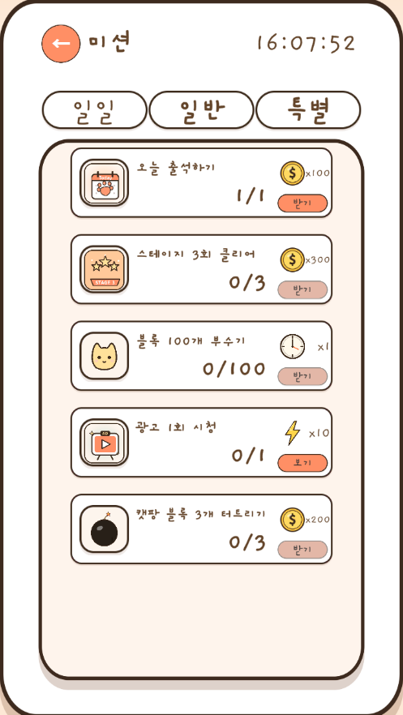

<details>
<summary>구조 — 어떻게 구성했나</summary>

- `CHMTime` 이 부팅 시 NTP(`time.google.com` → `pool.ntp.org` 폴백)로 서버 시각을 1회 받고, 이후 `realtimeSinceStartup` 경과로 보정합니다 — 디바이스 시각에 의존하지 않습니다.
- `DailyMissionService` 는 모든 진입점에서 `CheckAndResetIfNeeded()` 를 먼저 호출하고, **NTP 미수신 상태에서는 리셋하지 않아** 위변조에 안전합니다.
- 저장은 로컬(JSON, `CHMData`) + Google Play 클라우드(`"CatPang"` 슬롯)로 이중화되어 GPGS 연결 시 동기화됩니다.

</details>

## 5. 🐱 컬렉션 & 수익화 / 소셜

> **게임:** 왕관·딸기·산타 등 6종 테마 스킨을 수집해 고양이 블록 외형을 바꿉니다. 광고·인앱 결제·리더보드로 라이브 운영 요소를 갖췄습니다.

| 골드 상점(스킨) | 유료 상점(IAP) | 랭킹(리더보드) |
|:---:|:---:|:---:|
| 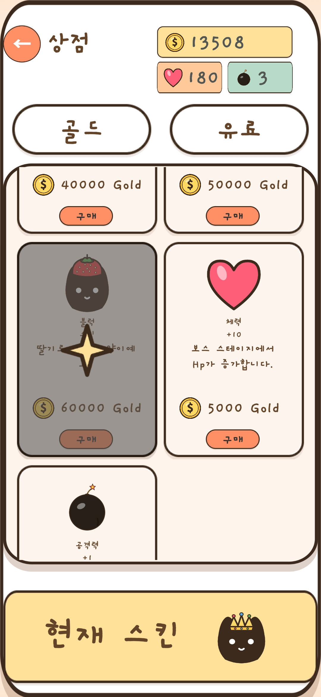 | 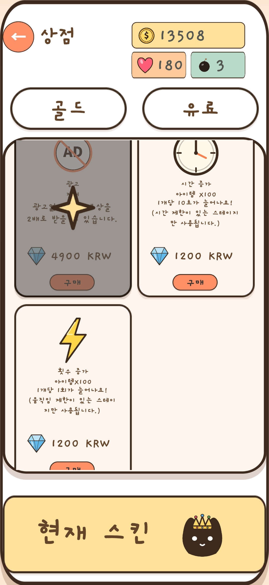 | 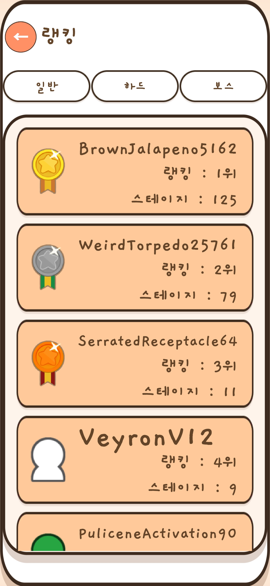 |

<details>
<summary>구조 — 어떻게 구성했나</summary>

- 광고(`CHMAdmob`)·결제(`CHMIAP`)·소셜(`CHMGPGS`)은 각각 `UNITY_INFRA_ADS`/`UNITY_INFRA_IAP`/`UNITY_INFRA_SOCIAL` 스크립팅 심볼로 **컴파일 게이팅**되어, 모듈을 끄면 코드째 빠집니다.
- 보상형 광고 시청은 `DailyMissionService.OnAdWatched` 로 연결되어 미션 카운터를 올립니다.
- 미션·상점·랭킹 리스트는 공용 풀링 스크롤뷰(`CHPoolingScrollView` + `*ScrollViewItem`) 패턴으로 셀을 재사용합니다.

</details>

---

## 6. 🧰 자체 제작 툴체인 & 헤드리스 시뮬레이션

> **게임:** 매치-3 의 재미와 난이도는 **스테이지 설계와 밸런싱이 전부**입니다. 400개 스테이지를 빠르게 만들고, 사람이 일일이 플레이하지 않고도 클리어 가능성·블록 커버리지를 검증하는 도구가 콘텐츠만큼 중요했습니다.

| 스테이지 에디터 (9×9 그리드 배치) | 로컬라이즈 (한/영 문자열) |
|:---:|:---:|
| 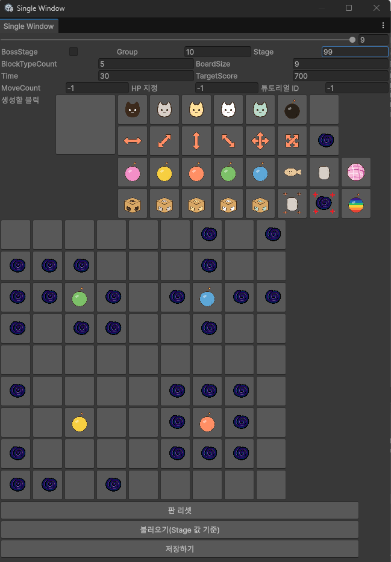 | 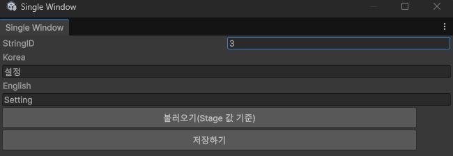 |

> 헤드리스 시뮬은 별도 화면 없이 콘솔 로그·`docs/qa-reports/*.md` 리포트로 결과를 남긴다.

<details>
<summary>구조 — 무엇을 만들었나</summary>

- **스테이지 에디터(`CHToolCreateMap`)** — 9×9 그리드를 시각적으로 편집해 JSON 으로 저장. 400개 스테이지를 전부 이 툴로 제작.
- **헤드리스 시뮬 하니스(`Assets/Scripts/Sim/`)** — 보드·매치·폭탄·중력 규칙을 **Unity 비의존 순수 C#** 으로 재구현하고, AI 정책(`ISimAiPolicy`)으로 자동 플레이. 노멀 모드 150 스테이지를 런타임 없이 돌려 클리어 가능 여부·블록 커버리지를 수집합니다(리포트는 `docs/qa-reports/`).
  - 실게임 드래그 규칙(고정 블록 스왑 금지 등)을 그대로 미러링해, 시뮬과 실게임의 판정 괴리를 막았습니다.
- **로컬라이즈 관리(`CHToolString`)** — 한국어/영어 문자열 사전 일괄 편집.
- **Addressables 마이그레이션(`CHToolMigrateToAddressables`)** — `AssetBundleResources/` 에셋에 `"Resource"` 라벨/그룹을 일괄 부여.
- **게임뷰 해상도 프리셋(`CHToolGameView`)** — 기기별 해상도를 메뉴로 전환.

</details>

---

# 📎 부록

## A. 실행 방법

**Prerequisites:** Unity **6000.0.68f1** (Unity 6) · Addressables · Android Build Support

1. Unity Hub 에서 프로젝트 루트를 엽니다.
2. Addressables 가 빌드되어 있지 않으면 `Window > Asset Management > Addressables > Groups` 에서 Build (모든 에셋이 `"Resource"` 라벨로 APK 에 포함).
3. `Assets/Scenes/ResourceDownloadScene.unity` (진입점, index 0) 를 열고 Play — 프리로드 → 매니저 초기화 → `FirstScene` 로비로 진입합니다. (씬을 중간부터 직접 열면 부팅 초기화를 건너뛰므로 반드시 `ResourceDownloadScene` 에서 시작.)
4. (선택) `CatPang` 메뉴의 스테이지 에디터·게임뷰 해상도, `Tools/ChvjUnityInfra/Settings` 에서 Ads/IAP/Social 모듈 토글.

## B. 기술 스택 & 의존 방향

- **엔진**: Unity 6 (6000.0.68f1) · **언어**: C# · **빌드 타깃**: Android(Google Play)
- **아키텍처**: 매니저 허브(`CHMMain`) + MVVM + 데이터 주도(JSON) · **에셋 로딩**: Addressables(enum=파일명 규칙)
- **인프라 패키지**: 자체 제작 공용 패키지 `com.chvj.unityinfra`(리소스·풀·UI·오디오·광고/IAP/소셜) — 게임 코드가 일방향으로 의존
- **반응형/트윈**: UniRx(`ReactiveProperty`) · DOTween · **텍스트**: TextMesh Pro(`CHText` 래퍼)

| 분류 | 내용 |
|------|------|
| **리소스** | Unity Addressables (`"Resource"` 라벨, Local 그룹 → APK 포함) |
| **UI** | TextMesh Pro + 커스텀 래퍼(`CHText`/`CHButton`/`CHToggle`) + UI 캐싱(`CHMUI`) |
| **광고 / 결제 / 소셜** | Google Mobile Ads · Unity Purchasing · Google Play Games SDK (심볼 게이팅) |
| **테스트** | 헤드리스 시뮬(`Sim/`, 순수 C#) + EditMode 러너(`SimTestRunner`) |

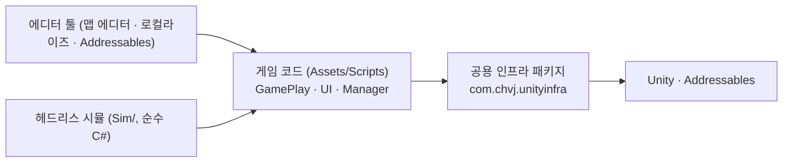

## C. 폴더 구조

```
Assets/
├── Scripts/                     런타임 게임 코드
│   ├── GamePlay/                보드 · 매치 판정 · 폭탄 연쇄 · 보스 AI · 튜토리얼
│   ├── Manager/                 CHMMain 허브 · 리소스/풀/UI/사운드/시간/데이터 어댑터
│   ├── UI/                      UIBase 파생 패널 (상점 · 미션 · 게임시작/종료 등)
│   ├── Scenes/                  씬별 진입 스크립트 (ResourceDownload · 로비 · GameScene)
│   ├── Lobby/                   GPGS 로그인 · 튜토리얼
│   ├── ScrollView/              풀링 스크롤뷰 항목 (미션 · 상점 · 랭킹)
│   ├── Sim/                     헤드리스 시뮬 하니스 (Unity 비의존 순수 C#)
│   └── Editor/                  스테이지 에디터 · 게임뷰 · 로컬라이즈 · Addressables 툴
├── AssetBundleResources/        Addressable 에셋 (ui · unit · effect · sprite · sound · font · data · json)
└── Scenes/                      ResourceDownloadScene(index 0) · FirstScene · GameScene

Packages/com.chvj.unityinfra/    자체 UPM 인프라 패키지 (Core · Resource · Pool · Audio · UI · Ads · Iap · Social)
docs/design/                     기능 기획서 + 콘텐츠 감사
docs/qa-reports/                 헤드리스 시뮬 리포트
```

